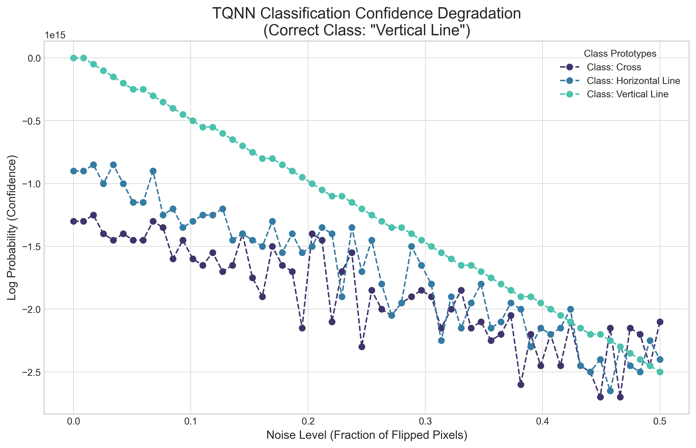
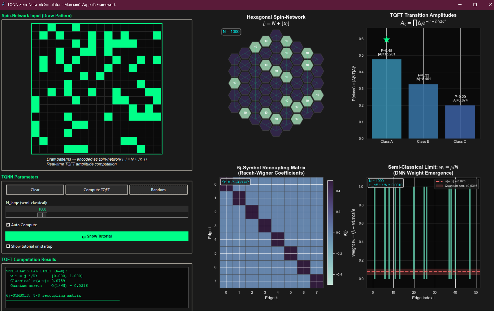
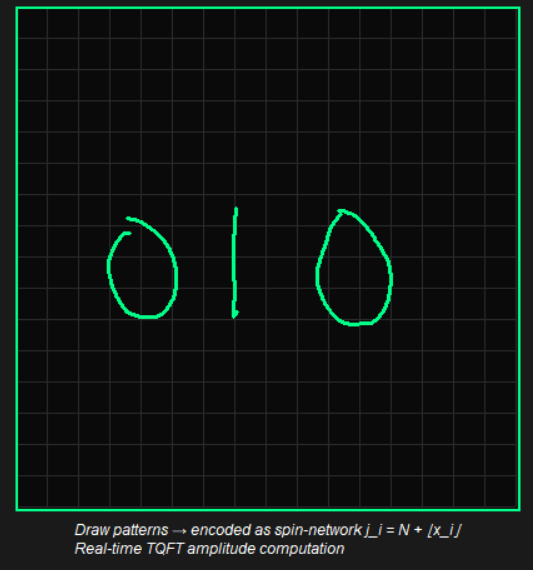
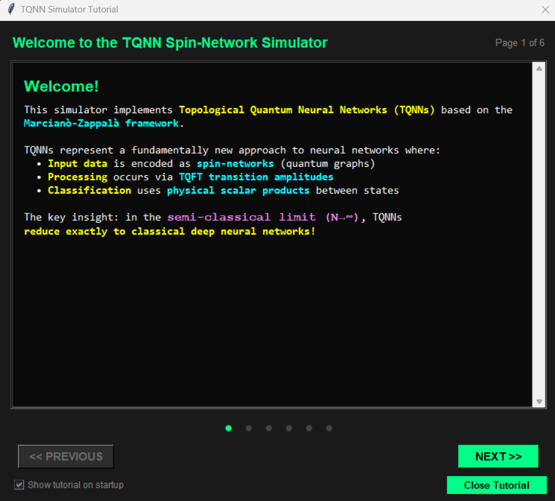
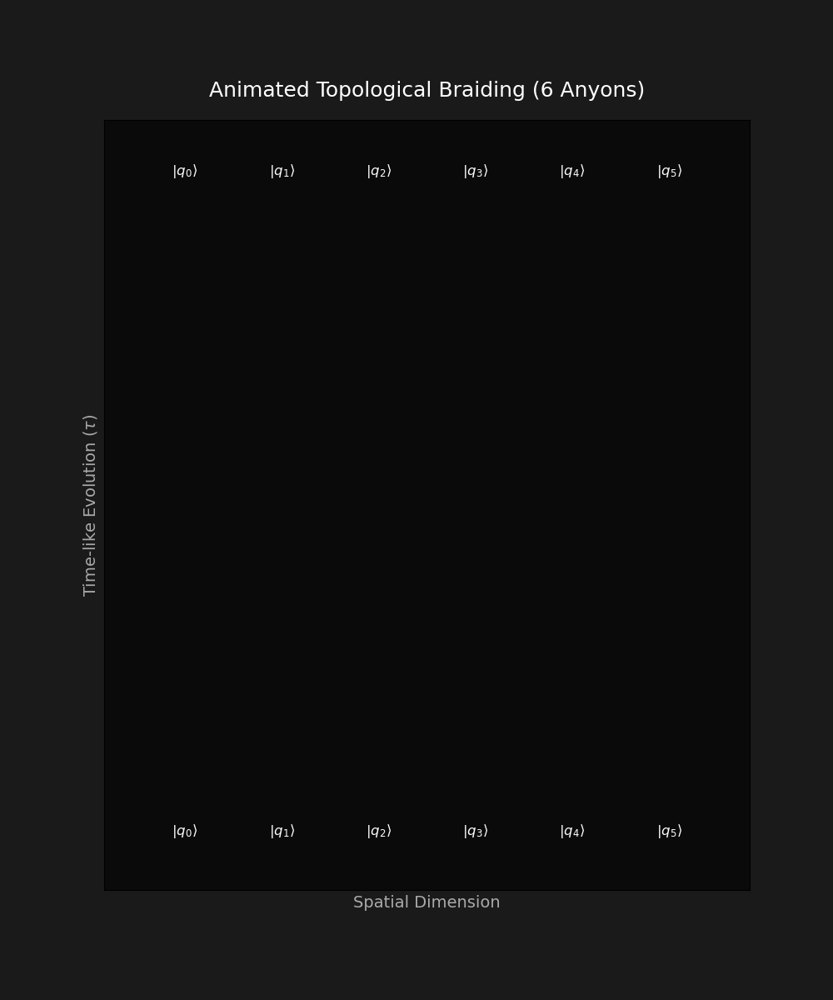
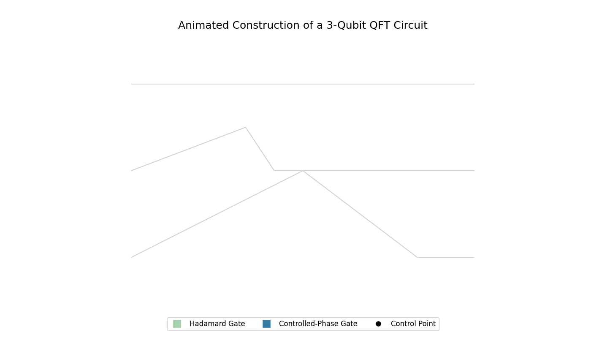
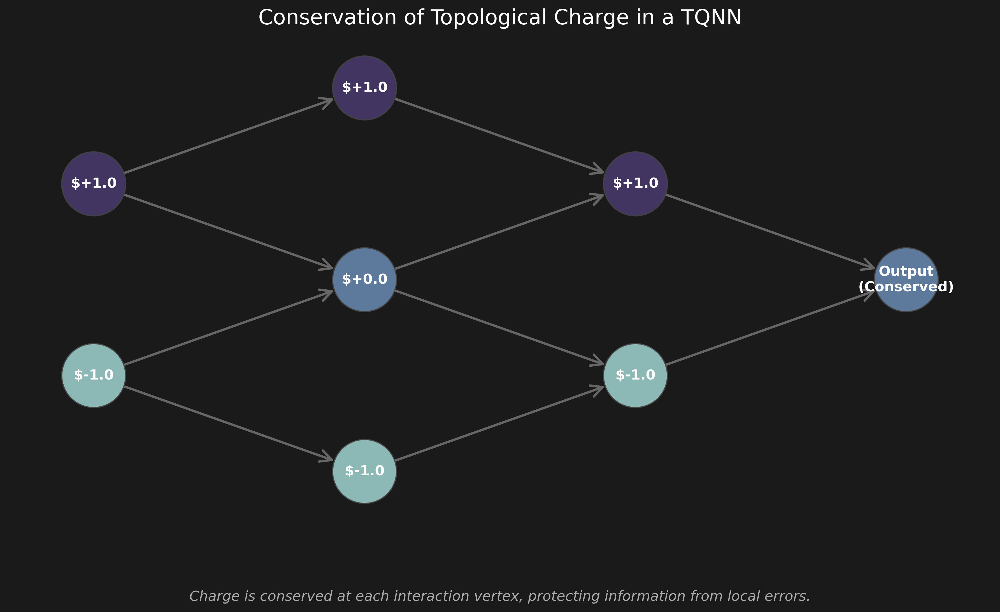

# Topological Quantum Neural Networks

###### Topological quantum field theory based communication networks for image processing and large language models.




This repository contains the research and implementation of a Topological Quantum Neural Network (TQNN), a novel machine learning paradigm based on the principles of Topological Quantum Field Theory (TQFT). This work explores the theoretical foundations of TQNNs, their relationship to Deep Neural Networks (DNNs), and their inherent robustness to noise.

## 1. Algorithm Overview

The core thesis, inspired by the research of Marcianò, Fields, Lulli, and others, is that conventional DNNs can be understood as the semi-classical limit of a more general TQNN framework. TQNNs leverage the properties of topological invariants, which makes them naturally resilient to local perturbations and noise, a quality referred to as "topological protection."

This implementation provides practical tools for exploring topological quantum computing concepts:
- Interactive real-time tensor network decomposition and visualization
- Pattern classification with topological robustness analysis
- Educational visualizations demonstrating TQNN principles

<p align="center">
  
</p>

## 2. Theoretical Background

A TQNN processes information encoded in quantum states, specifically **spin-networks**. These are graphs whose edges are labeled by irreducible representations of a quantum group (e.g., $SU(2)_k$), called "colors" ($j$), and whose nodes represent quantum entanglement transformations (intertwiners).

The input data, such as a pixel grid from an image, is encoded into the colors of a spin-network. For a pixel value $x_i$, a common encoding is:

$$j_i = N + \lfloor x_i \rfloor$$

where $N$ is a large integer, placing the system in the semi-classical regime.

The core operation of a TQNN is the evaluation of a TQFT functor, $Z$, which maps a topological object (a **cobordism**, representing the evolution of spin-networks) to a complex number (a **transition amplitude**). For a cobordism $M$ from an initial state $\Sigma_{\text{in}}$ to a final state $\Sigma_{\text{out}}$, the amplitude is given by:

$$Z(M): Z(\Sigma_{\text{in}}) \to Z(\Sigma_{\text{out}})$$

In the TQNN Perceptron model, this amplitude is calculated for an input pattern against pre-computed class prototypes. The prototype for a class $c$ is defined by the mean ($\bar{j}$) and standard deviation ($\sigma$) of spin colors from training examples. The amplitude is given by:

$$A_c \propto \prod_{i} \Delta_{j_i} e^{-\frac{(j_i - j_{c,i})^2}{2\sigma_{c,i}^2}}$$

where $\Delta_{j_i} = j_i + 1$ is the quantum dimension of the representation $j_i$. This formula shows that the most likely classification corresponds to the prototype that is "closest" to the input state in the quantum-mechanical sense, without any iterative training. This inherent robustness to local noise is a key advantage of the TQNN framework.

## 3. Implementation Methods

The following implementations demonstrate the core concepts of topological quantum neural networks.

### Real-Time Tensor Network Simulator

This interactive application provides real-time visualization of Topological Quantum Neural Networks (TQNN) based on the Marciano-Zappala framework. Users draw patterns on a canvas which are immediately encoded as hexagonal spin-networks. The simulator demonstrates how TQNNs process visual information through TQFT transition amplitudes and 6j-symbol recoupling, making abstract topological concepts tangible through direct manipulation.

The quantum state from drawn patterns is decomposed into MPS form through successive singular value decompositions. For a quantum state $|\psi\rangle$ with $n$ qubits, the MPS decomposition represents it as:

$$|\psi\rangle = \sum_{i_1,\ldots,i_n} A^{[1]}_{i_1} A^{[2]}_{i_2} \cdots A^{[n]}_{i_n} |i_1 i_2 \cdots i_n\rangle$$

where $A^{[k]}$ are the MPS tensors with bond dimension $\chi$, and the entanglement entropy $S$ across a bipartition is computed from the Schmidt values $\lambda_i$:

$$S = -\sum_i \lambda_i^2 \log_2(\lambda_i^2)$$

```python
# From Code+/Real Time Simulation/interactive_tqnn_tensor_network.py
class TQNNProcessor:
    def compute_transition_amplitude(self, input_spins: np.ndarray, 
                                    proto_mean: np.ndarray, 
                                    proto_std: np.ndarray) -> Tuple[complex, float]:
        """
        Compute TQFT transition amplitude using the semi-classical formula.
        From Marciano et al., the amplitude in the large-j limit is:
        A = \prod_i \Delta_{j_i} * exp(-(j_i - j-bar_i)^2/(2\sigma_i^2))
        """
        min_len = min(len(input_spins), len(proto_mean), len(proto_std))
        j = input_spins[:min_len]
        j_bar = proto_mean[:min_len]
        sigma = proto_std[:min_len]
        
        # Quantum dimension contribution: log(\Delta_j) = log(2j + 1)
        log_quantum_dim = np.sum(np.log(2 * j + 1))
        
        # Gaussian suppression term: -(j - j-bar)^2/(2\sigma^2)
        gaussian_term = -np.sum((j - j_bar)**2 / (2 * sigma**2))
        
        # Log amplitude (for numerical stability)
        log_amplitude = log_quantum_dim + gaussian_term
        amplitude = np.exp(log_amplitude / min_len)
        
        return amplitude, log_amplitude

```



The simulator adittionallyfeatures a dedicated drawing canvas where users can sketch input patterns. These drawings are instantly digitized and mapped onto a hexagonal lattice. The visualization panel updates in real-time to show the corresponding spin values j on the network edges, allowing users to see exactly how their visual input is translated into topological quantum states.



Finally, To help users navigate the theoretical concepts, the application includes a comprehensive interactive tutorial. This guide walks through the spin-network encoding process, the meaning of TQFT transition amplitudes, the role of 6$j$-symbols in recoupling at the vertices, and how the semi-classical limit recovers standard neural network weights as $N \rightarrow \infty$.



### Interactive TQNN Environment

The interactive TQNN environment provides a real-time visualization of TQNN concepts, including pattern classification with adjustable noise, anyonic braiding patterns, charge flow through networks, and robustness analysis. Users can interact with the system by modifying patterns, adjusting noise levels, and observing the network's response in real-time.

The interactive environment visualizes multiple aspects of TQNNs, including the classification confidence which is calculated as a normalized probability distribution using a temperature-scaled softmax:

$$P(c) = \frac{e^{\log(A_c)/T}}{\sum_{k} e^{\log(A_k)/T}}$$

where $A_c$ is the TQNN amplitude for class $c$ and $T$ is the temperature parameter controlling the "sharpness" of the distribution.

```python
# From Code+/Image Classification/interactive_tqnn_gui.py
class TQNNVisualization:
    def draw_classification(self):
        """Draw classification results with real-time confidence"""
        if self.simulator.log_probabilities:
            # Calculate normalized probabilities
            labels = list(self.simulator.log_probabilities.keys())
            values = list(self.simulator.log_probabilities.values())
            
            # Visualize classification confidence
            bars = self.ax_classification.bar(
                range(len(labels)), 
                values,
                color=[seqCmap(0.7) if label == self.simulator.prediction_result 
                       else seqCmap(0.3) for label in labels]
            )
            
            # Highlight correct class
            correct_idx = labels.index(self.simulator.current_pattern_label)
            bars[correct_idx].set_color('green')
            bars[correct_idx].set_alpha(0.7)
```


### Topological Operations: Braiding

This animation shows the braiding of anyons, which are quasi-particle excitations in a 2D topological system. Their world-lines form braids, and the final quantum state depends only on the topology of the braid, not the specific paths taken. This is the source of the TQNN's robustness and corresponds to quantum gate operations.

Braiding operations are governed by the Yang-Baxter equation, which ensures that the outcome of a complex braid is unambiguous.

$$(B \otimes I)(I \otimes B)(B \otimes I) = (I \otimes B)(B \otimes I)(I \otimes B)$$

This visualization is pre-existing. The animation below, generated by the sandbox, is created using a similar principle with `matplotlib`.
```python
# From Code/tqnn_sandbox.py
def animate_robustness_test(tqnn, test_pattern, test_label, noise_levels, animation_path):
    """
    Creates a GIF animation of the TQNN robustness test.
    """
    print(f"Generating animation and saving to {animation_path}...")
    # ... setup logic for history calculation and plot aesthetics ...
    fig = plt.figure(figsize=(16, 7))
    ax1 = fig.add_subplot(1, 2, 1)
    ax2 = fig.add_subplot(1, 2, 2, polar=True)

    def update(frame):
        # This function is called for each frame of the animation.
        # It clears previous plots, adds noise to the image,
        # gets the new prediction, and redraws both the image
        # and the radial confidence plot.
        pass

    # The FuncAnimation object from matplotlib stitches together
    # the frames generated by the update function.
    anim = FuncAnimation(fig, update, frames=len(noise_levels), interval=150, repeat_delay=1000)
    anim.save(animation_path, writer='pillow', fps=5)
```



---

### TQNN Circuit Diagram

This animation illustrates a more complex quantum circuit within the TQNN framework, demonstrating how multiple braiding and fusion operations can be composed to perform a larger computation.

The overall operation is a composition of unitary transformations, each corresponding to a gate or braid in the circuit.

$$U_{\text{total}} = U_n \circ \dots \circ U_1$$

Similar to the braiding animation, this is a conceptual visualization. The principle of creating animations is demonstrated in the example files.
```python
# From Code/Examples/exampleAnimation.py
# Set up the figure and axis for the animation
fig, ax = plt.subplots(figsize=(10, 6))
ax.set_xlim(0.3, 4.0)
ax.set_ylim(-1.2, 0.5)
ax.set_xlabel('H-H Bond Distance (Angstrom)')
ax.set_ylabel('Potential Energy (Hartree)')
ax.set_title('Dissociation of H2 Molecule')

# Initialize the plot elements that will be updated
line, = ax.plot([], [], 'o-', lw=2, color='darkblue', label='Potential Energy')
text = ax.text(0.05, 0.9, '', transform=ax.transAxes)

# Define the function that updates the plot for each frame
def update(frame):
    # Update the data for the line and text
    line.set_data(distances[:frame+1], energies[:frame+1])
    text.set_text(f'Distance: {distances[frame]:.2f} Å\nEnergy: {energies[frame]:.4f} Ha')
    return line, text

anim = FuncAnimation(fig, update, frames=len(distances), interval=50, blit=True)
anim.save('h2_dissociation.gif', writer='imagemagick', fps=30)
```



---

### Charge Flow in Spin-Networks

This diagram visualizes how "charges" (quantum information) flow through a spin-network. At each node (intertwiner), spins combine according to specific "fusion rules" that conserve quantum numbers, analogous to Kirchhoff's laws in classical circuits.

The fusion of two spins $j_1$ and $j_2$ is governed by fusion rules, which dictate the possible resulting spins $j_3$. For $SU(2)$, this is:

$$j_1 \otimes j_2 = \bigoplus_{j_3=|j_1-j_2|}^{j_1+j_2} j_3$$

This is a static conceptual image. Static plots in this project are generated using `matplotlib` as shown below.
```python
# From Code/Examples/exampleStatic.py
def plot_vqe_optimization(energies, angles):
    """
    Plots the energy of a VQE calculation as a function of a variational parameter.
    """
    fig, ax = plt.subplots(figsize=(10, 6))
    ax.plot(angles, energies, 'o-', color='purple', label='VQE Energy')
    
    # Add labels, title, and grid for better readability
    ax.set_xlabel('Variational Angle (radians)')
    ax.set_ylabel('Energy (Hartree)')
    ax.set_title('VQE Optimization for H2 Molecule')
    ax.grid(True, linestyle='--', alpha=0.6)
    
    ax.legend()
    plt.savefig("vqe_optimization.png", dpi=300, bbox_inches='tight')
    plt.show()
```


---

## 4. TQNN Sandbox Environment

To demonstrate the principles of TQNNs, this repository includes a sandbox environment (`Code/tqnn_sandbox.py`). This script builds a simplified TQNN Perceptron to classify geometric patterns and, most importantly, demonstrates its robustness to noise.

### Sandbox: Static Analysis

The plot below shows the TQNN's classification confidence for a "Vertical Line" pattern as noise is introduced. The model's prediction remains correct up to a high noise level, highlighting its resilience.

The plot visualizes the log-probability derived from the TQNN amplitude calculation, where the winning class has the highest value.

$$\text{prediction} = \arg\max_{c} \left( \log|A_c|^2 \right)$$

```python
# From Code/tqnn_sandbox.py
def plot_degradation(results, target_label, plot_path):
    """
    Plots the degradation of classification confidence vs. noise level.
    """
    print(f"Generating plot and saving to {plot_path}...")
    noise_levels = sorted(results.keys())
    palette = sns.color_palette("mako", n_colors=len(results[0.0]))
    
    plt.style.use('seaborn-v0_8-whitegrid')
    fig, ax = plt.subplots(figsize=(12, 7))
    
    # Loop over each class and plot its confidence degradation
    for i, label in enumerate(results[0.0].keys()):
        log_probs = [results[noise][label] for noise in noise_levels]
        ax.plot(
            noise_levels, log_probs, marker='o', 
            linestyle='--', label=f'Class: {label}', color=palette[i]
        )

    plt.savefig(plot_path, dpi=300, bbox_inches='tight')
    plt.close()
```


## 5. How to Run the Sandbox

To run the sandbox and regenerate these visuals, execute the following command from the project root:
```bash
python Code/tqnn_sandbox.py
```

## 6. Next Steps

- [x] **Foundation Review**: Read and synthesize background research papers on TQFTs and TQNNs.
- [x] **Code Standards Review**: Analyze example code to establish project conventions for documentation and style.
- [x] **Sandbox Implementation**: Build the TQNN perceptron model, spin-network encoders, and visualization helpers.
- [x] **Visualization & Animation**: Create static and dynamic plots to demonstrate topological robustness against noise.
- [x] **Documentation**: Generate comprehensive `README.md` files for the project root and `Code/` directory.
- [ ] **Advanced TQNN Models**: Extend the sandbox to include more complex architectures, such as those with multiple layers or different quantum groups.
- [ ] **Performance Optimization**: Profile and optimize the spin-network evaluation algorithms, potentially integrating with high-performance computing libraries.

> [!TIP]
> For detailed mathematical proofs and a deeper dive into the recoupling theory used to evaluate spin-networks, refer to the `Exact hexagonal spin-networks and TQNNs` paper in the `References/Papers` directory.

> [!NOTE]
> This implementation serves as both a research prototype and an educational tool for understanding TQNNs. The models are simplified for clarity and may not be suitable for production-level machine learning tasks without further development.

> [!IMPORTANT]
> The TQNN sandbox simulates the behavior of a quantum system on classical hardware. While it demonstrates the principles of topological robustness, it does not provide the computational advantages of a true quantum computer.

## 7. References
- *DNNs as the Semi-Classical Limit of TQNNs*, A. Marcianò, et al.
- *Exact hexagonal spin-networks and TQNNs*, M. Lulli, et al.
- *Sequential measurements, TQFTS, and TQNNs*, C. Fields, et al. 


